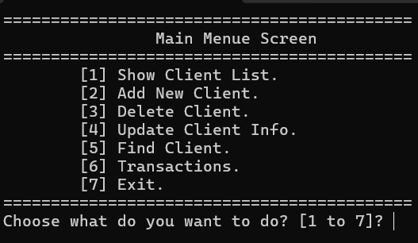
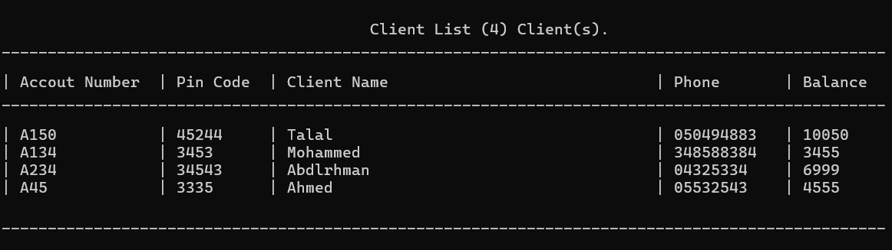
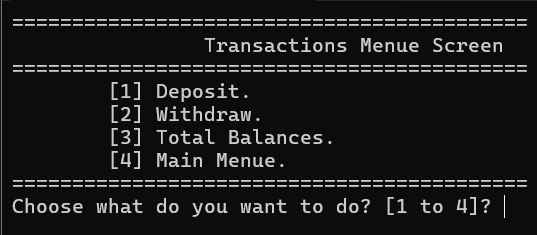

<h1 align="center">Console-Based Bank Management System</h1>

  <em>A backend-focused banking system built from scratch in C++ that simulates real banking operations.</em>

  
  
  

  <a href="#overview">Overview</a> &nbsp;|&nbsp;
  <a href="#key-features">Key Features</a> &nbsp;|&nbsp;
  <a href="#skills-demonstrated">Skills</a> &nbsp;|&nbsp;
  <a href="#screenshots">Screenshots</a> &nbsp;|&nbsp;
  <a href="#how-to-run">How to Run</a> &nbsp;|&nbsp;
  <a href="#developed-by">Developed By</a>

---

## Overview

This project is a backend-focused, console-based banking system developed in C++ that simulates real banking operations such as deposits, withdrawals, and transfers. It includes secure login, user authentication, role-based access control, and file-based data persistence.

All core components were implemented from scratch. The focus of the project is a clean structure, readable code, and logic that is easy to maintain and extend.

---

## Key Features

| Feature | Description |
| :-- | :-- |
| **Deposits** | Add funds to a client's account |
| **Withdrawals** | Withdraw funds from a client's account |
| **Transfers** | Transfer funds between accounts |
| **Client Management** | Store and view the bank's clients |
| **Transaction Records** | View the list of transactions performed in the system |
| **Secure Login** | Users must authenticate before using the system |
| **Role-Based Access Control** | Permissions are enforced according to each user's role |
| **File-Based Data Persistence** | Data is saved between runs |

---

## Skills Demonstrated

<h3 align="center">
  C++ &nbsp;|&nbsp; Back-End Operations &nbsp;|&nbsp; Algorithms
   
  Critical Thinking &nbsp;|&nbsp; Problem Solving &nbsp;|&nbsp; File Handling
</h3>

---

## Screenshots

<h2 align="center">Main Menu</h2>

<h3 align="center">The central point from which every operation of the system is reached.</h3>

  

<h2 align="center">Client List</h2>

<h3 align="center">The list of the bank's clients and their information.</h3>

  

<h2 align="center">Transaction List</h2>

<h3 align="center">The list of transactions performed in the system.</h3>

  

---

## How to Run

1. Download or clone this repository. Click **Code**, then **Download ZIP**, or clone it with Git.
2. Open `Bank_Management_System.sln` in Visual Studio.
3. Set the configuration to **Debug** and **x64**.
4. Press **Ctrl+F5** to build and run the project.

---

## Developed By

<h1 align="center">Talal Altuwairiqi</h1>

  
  
  

